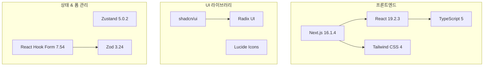
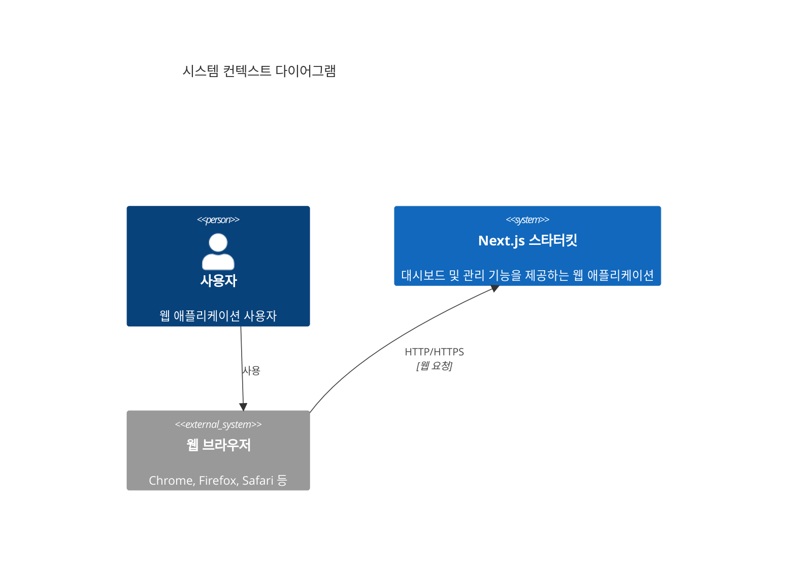
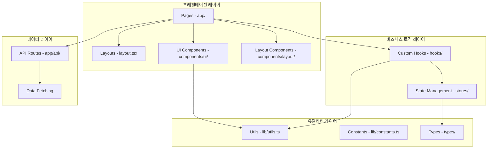
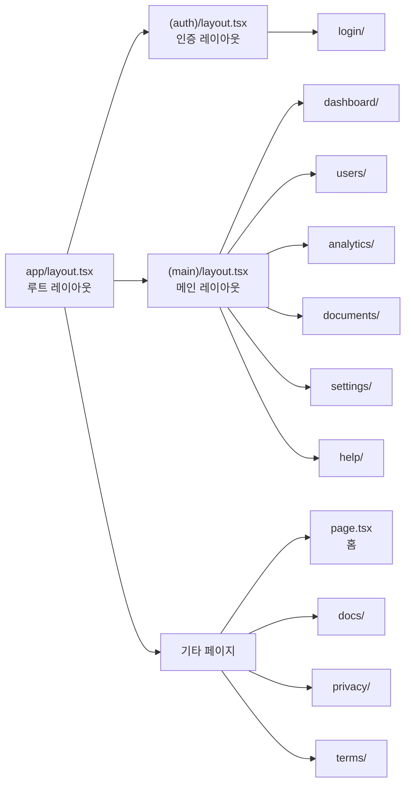
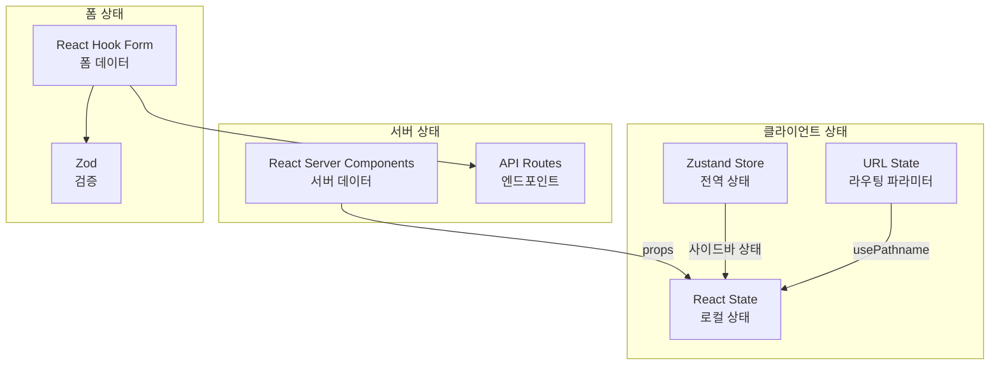
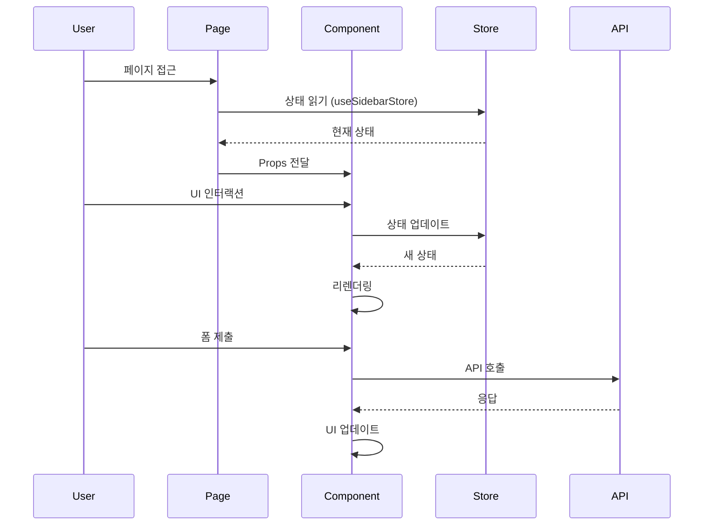
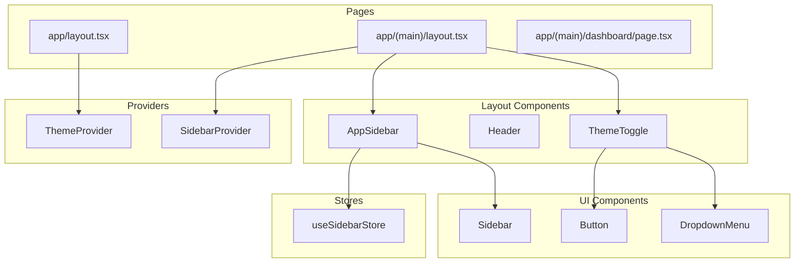
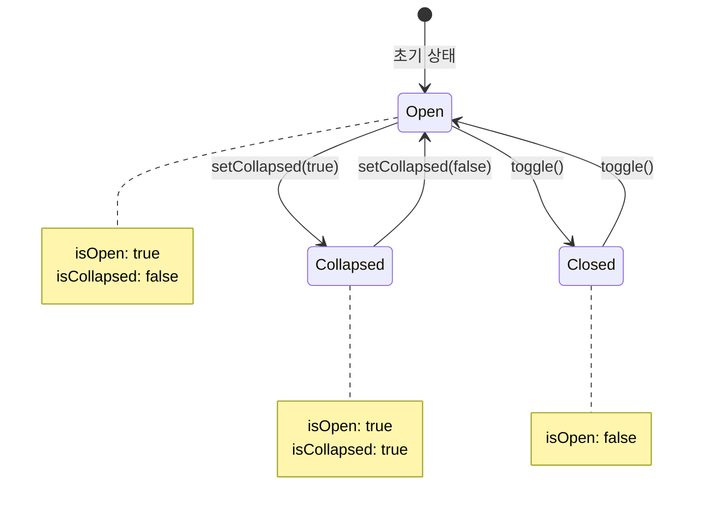

# 시스템 아키텍처 문서

## 문서 정보

- **프로젝트명**: claude-nextjs-starterkit
- **버전**: v1.0.0
- **최종 수정일**: 2026-01-27
- **작성 기준**: main 브랜치 (commit: 68a4cec)

---

## 1. 개요

### 1.1 프로젝트 목적
Next.js 15 기반의 모던 웹 애플리케이션 스타터킷으로, 대시보드, 사용자 관리, 인증 등의 일반적인 비즈니스 애플리케이션 기능을 제공합니다.

### 1.2 주요 특징
- **최신 기술 스택**: Next.js 15 App Router, React 19
- **타입 안정성**: TypeScript 엄격 모드
- **반응형 디자인**: Tailwind CSS 4 기반 UI
- **상태 관리**: Zustand를 활용한 경량 상태 관리
- **폼 검증**: React Hook Form + Zod
- **UI 컴포넌트**: shadcn/ui (Radix UI 기반)
- **테마 지원**: 라이트/다크 모드 토글

### 1.3 기술 스택 요약



---

## 2. 기술 스택

### 2.1 코어 프레임워크 및 런타임

| 기술 | 버전 | 용도 |
|------|------|------|
| **Next.js** | 16.1.4 | React 메타 프레임워크, App Router 기반 |
| **React** | 19.2.3 | UI 라이브러리 |
| **TypeScript** | 5.x | 정적 타입 시스템 |
| **Node.js** | 20+ | 런타임 환경 |

### 2.2 UI & 스타일링

| 기술 | 버전 | 용도 |
|------|------|------|
| **Tailwind CSS** | 4.x | 유틸리티 기반 CSS 프레임워크 |
| **@tailwindcss/postcss** | 4.x | PostCSS 플러그인 |
| **tw-animate-css** | 1.4.0 | Tailwind 애니메이션 확장 |
| **next-themes** | 0.4.4 | 테마 전환 (라이트/다크 모드) |
| **class-variance-authority** | 0.7.1 | 조건부 스타일 관리 |
| **clsx** | 2.1.1 | 클래스명 조건부 병합 |
| **tailwind-merge** | 3.4.0 | Tailwind 클래스명 충돌 해결 |

### 2.3 UI 컴포넌트 라이브러리

#### shadcn/ui 기반 컴포넌트
Radix UI 기반으로 구축된 재사용 가능한 컴포넌트:

| 컴포넌트 | Radix 패키지 | 용도 |
|----------|--------------|------|
| **Accordion** | @radix-ui/react-accordion | 접을 수 있는 콘텐츠 |
| **Avatar** | @radix-ui/react-avatar | 사용자 프로필 이미지 |
| **Checkbox** | @radix-ui/react-checkbox | 체크박스 입력 |
| **Dialog** | @radix-ui/react-dialog | 모달 대화상자 |
| **Dropdown Menu** | @radix-ui/react-dropdown-menu | 드롭다운 메뉴 |
| **Label** | @radix-ui/react-label | 폼 라벨 |
| **ScrollArea** | @radix-ui/react-scroll-area | 커스텀 스크롤 영역 |
| **Select** | @radix-ui/react-select | 선택 드롭다운 |
| **Separator** | @radix-ui/react-separator | 구분선 |
| **Switch** | @radix-ui/react-switch | 토글 스위치 |
| **Tooltip** | @radix-ui/react-tooltip | 툴팁 |
| **Collapsible** | @radix-ui/react-collapsible | 접을 수 있는 영역 |

#### 추가 UI 라이브러리

| 기술 | 버전 | 용도 |
|------|------|------|
| **lucide-react** | 0.563.0 | 아이콘 라이브러리 |
| **sonner** | 1.7.2 | 토스트 알림 |

### 2.4 상태 관리 및 폼 처리

| 기술 | 버전 | 용도 |
|------|------|------|
| **Zustand** | 5.0.2 | 전역 상태 관리 (사이드바 상태 등) |
| **React Hook Form** | 7.54.2 | 폼 관리 및 검증 |
| **Zod** | 3.24.1 | 스키마 검증 |
| **@hookform/resolvers** | 3.9.0 | React Hook Form + Zod 연동 |

### 2.5 유틸리티 라이브러리

| 기술 | 버전 | 용도 |
|------|------|------|
| **usehooks-ts** | 3.1.0 | React 커스텀 훅 모음 |

### 2.6 개발 도구

| 기술 | 버전 | 용도 |
|------|------|------|
| **ESLint** | 9.x | 코드 린팅 |
| **eslint-config-next** | 16.1.4 | Next.js ESLint 설정 |

---

## 3. 시스템 구조

### 3.1 C4 모델 - 컨텍스트 다이어그램



### 3.2 디렉토리 구조

```
claude-nextjs-starterkit/
├── app/                      # Next.js App Router 기반 페이지
│   ├── (auth)/              # 인증 관련 라우트 그룹
│   │   ├── layout.tsx       # 인증 레이아웃
│   │   └── login/           # 로그인 페이지
│   │       └── page.tsx
│   ├── (main)/              # 메인 애플리케이션 라우트 그룹
│   │   ├── layout.tsx       # 메인 레이아웃 (사이드바 포함)
│   │   ├── dashboard/       # 대시보드
│   │   ├── analytics/       # 분석
│   │   ├── users/           # 사용자 관리
│   │   │   ├── page.tsx     # 사용자 목록
│   │   │   ├── roles/       # 역할 관리
│   │   │   └── permissions/ # 권한 관리
│   │   ├── documents/       # 문서 관리
│   │   ├── settings/        # 설정
│   │   └── help/            # 도움말
│   ├── docs/                # 문서 페이지
│   ├── privacy/             # 개인정보처리방침
│   ├── terms/               # 이용약관
│   ├── layout.tsx           # 루트 레이아웃
│   ├── page.tsx             # 홈 페이지
│   └── globals.css          # 전역 스타일
│
├── components/              # React 컴포넌트
│   ├── ui/                  # shadcn/ui 기반 UI 컴포넌트
│   │   ├── button.tsx
│   │   ├── card.tsx
│   │   ├── dialog.tsx
│   │   ├── input.tsx
│   │   ├── sidebar.tsx
│   │   └── ... (25개 이상)
│   ├── layout/              # 레이아웃 컴포넌트
│   │   ├── app-sidebar.tsx  # 앱 사이드바
│   │   ├── header.tsx       # 헤더
│   │   ├── footer.tsx       # 푸터
│   │   ├── mobile-nav.tsx   # 모바일 네비게이션
│   │   └── theme-toggle.tsx # 테마 토글 버튼
│   ├── common/              # 공통 컴포넌트
│   │   ├── logo.tsx         # 로고
│   │   └── loading-spinner.tsx # 로딩 스피너
│   └── providers/           # Context Provider
│       └── theme-provider.tsx # 테마 제공자
│
├── lib/                     # 유틸리티 및 헬퍼
│   ├── utils.ts             # 공통 유틸리티 함수 (cn)
│   └── constants.ts         # 상수 정의
│
├── stores/                  # Zustand 스토어
│   └── use-sidebar-store.ts # 사이드바 상태 관리
│
├── types/                   # TypeScript 타입 정의
│   └── index.ts             # 공통 타입
│
├── hooks/                   # 커스텀 React 훅
│   └── index.ts             # usehooks-ts 재export
│
├── public/                  # 정적 파일
│
├── .claude/                 # Claude Code 설정
│   ├── agents/              # 커스텀 에이전트
│   └── commands/            # 커스텀 커맨드
│
├── _doc/                    # 프로젝트 문서
│   └── architecture/        # 아키텍처 문서
│
├── package.json             # 프로젝트 의존성
├── tsconfig.json            # TypeScript 설정
├── next.config.ts           # Next.js 설정
├── postcss.config.mjs       # PostCSS 설정
├── eslint.config.mjs        # ESLint 설정
├── components.json          # shadcn/ui 설정
└── README.md                # 프로젝트 README
```

### 3.3 레이어 아키텍처



### 3.4 라우트 그룹 구조

Next.js 15 App Router의 라우트 그룹 기능을 활용하여 레이아웃을 분리:



**라우트 그룹 설명**:
- `(auth)`: 인증 관련 페이지 (로그인, 회원가입 등) - 사이드바 없는 심플한 레이아웃
- `(main)`: 메인 애플리케이션 페이지 - 사이드바와 헤더가 포함된 레이아웃
- 루트 레벨: 랜딩 페이지, 문서, 법적 문서 등

---

## 4. 핵심 컴포넌트

### 4.1 레이아웃 시스템

#### 4.1.1 루트 레이아웃 (app/layout.tsx)
**역할**: 전체 애플리케이션의 공통 레이아웃

**주요 기능**:
- HTML 기본 구조 정의
- 전역 폰트 설정 (Geist Sans, Geist Mono)
- ThemeProvider를 통한 테마 관리
- 전역 토스트 알림 (Sonner)

**의존성**:
- `ThemeProvider` (components/providers/theme-provider.tsx)
- `Toaster` (components/ui/sonner.tsx)

```typescript
// 핵심 구조
<html lang="ko" suppressHydrationWarning>
  <body>
    <ThemeProvider>
      {children}
      <Toaster />
    </ThemeProvider>
  </body>
</html>
```

#### 4.1.2 메인 레이아웃 (app/(main)/layout.tsx)
**역할**: 대시보드 및 관리 페이지의 공통 레이아웃

**주요 기능**:
- 사이드바 + 콘텐츠 영역 구조
- 상단 헤더 바 (사이드바 토글, 테마 토글)
- 반응형 레이아웃

**의존성**:
- `SidebarProvider` (UI 컴포넌트)
- `AppSidebar` (components/layout/app-sidebar.tsx)
- `ThemeToggle` (components/layout/theme-toggle.tsx)

```typescript
// 핵심 구조
<SidebarProvider>
  <AppSidebar />
  <SidebarInset>
    <header>{/* 헤더 바 */}</header>
    <main>{children}</main>
  </SidebarInset>
</SidebarProvider>
```

#### 4.1.3 인증 레이아웃 (app/(auth)/layout.tsx)
**역할**: 로그인/회원가입 페이지의 레이아웃

**특징**:
- 사이드바 없음
- 중앙 정렬된 심플한 레이아웃

### 4.2 네비게이션 시스템

#### 4.2.1 AppSidebar (components/layout/app-sidebar.tsx)
**역할**: 메인 애플리케이션의 사이드 네비게이션

**주요 기능**:
- 3단계 메뉴 구조 (메인, 관리, 기타)
- 계층적 서브메뉴 (Collapsible)
- 현재 경로 하이라이팅
- 툴팁 지원
- 로고 표시

**메뉴 구조**:
```typescript
메인:
  - 홈 (/)
  - 대시보드 (/dashboard)
  - 분석 (/analytics)

관리:
  - 사용자 (/users)
    - 목록 (/users)
    - 역할 (/users/roles)
    - 권한 (/users/permissions)
  - 문서 (/documents)

기타:
  - 설정 (/settings)
  - 도움말 (/help)
```

**의존성**:
- `usePathname` (Next.js)
- Lucide React 아이콘
- Radix UI Collapsible

#### 4.2.2 MobileNav (components/layout/mobile-nav.tsx)
**역할**: 모바일 환경의 네비게이션

**주요 기능**:
- Sheet 기반 슬라이드 메뉴
- 터치 친화적 UI

### 4.3 테마 시스템

#### 4.3.1 ThemeProvider (components/providers/theme-provider.tsx)
**역할**: next-themes를 활용한 테마 전환 관리

**주요 기능**:
- 시스템 테마 감지
- 라이트/다크/시스템 모드 지원
- 로컬 스토리지 자동 저장
- Hydration 이슈 방지

#### 4.3.2 ThemeToggle (components/layout/theme-toggle.tsx)
**역할**: 테마 전환 버튼

**주요 기능**:
- 드롭다운 메뉴로 테마 선택
- 현재 테마 아이콘 표시

### 4.4 상태 관리

#### 4.4.1 useSidebarStore (stores/use-sidebar-store.ts)
**역할**: 사이드바 상태 관리

**상태**:
- `isOpen`: 사이드바 열림/닫힘 상태
- `isCollapsed`: 사이드바 축소 상태

**액션**:
- `toggle()`: 열림/닫힘 토글
- `setOpen(open)`: 열림 상태 설정
- `setCollapsed(collapsed)`: 축소 상태 설정

**특징**:
- Zustand persist 미들웨어로 로컬 스토리지 자동 저장

### 4.5 UI 컴포넌트 시스템

shadcn/ui 기반의 재사용 가능한 컴포넌트 (components/ui/):

**기본 인터랙션**:
- `button.tsx`: 버튼 컴포넌트 (여러 variant 지원)
- `input.tsx`: 입력 필드
- `textarea.tsx`: 다중 줄 입력
- `label.tsx`: 폼 라벨
- `checkbox.tsx`: 체크박스
- `switch.tsx`: 토글 스위치
- `select.tsx`: 선택 드롭다운

**레이아웃**:
- `card.tsx`: 카드 컨테이너
- `separator.tsx`: 구분선
- `scroll-area.tsx`: 스크롤 영역
- `sheet.tsx`: 슬라이드 패널
- `sidebar.tsx`: 사이드바 프리미티브

**오버레이**:
- `dialog.tsx`: 모달 대화상자
- `dropdown-menu.tsx`: 드롭다운 메뉴
- `tooltip.tsx`: 툴팁

**피드백**:
- `sonner.tsx`: 토스트 알림
- `skeleton.tsx`: 스켈레톤 로더
- `badge.tsx`: 배지

**구조적**:
- `accordion.tsx`: 아코디언
- `avatar.tsx`: 아바타 이미지

---

## 5. 데이터 흐름

### 5.1 상태 관리 전략



**상태 관리 계층**:

1. **전역 클라이언트 상태** (Zustand)
   - 사이드바 열림/닫힘 상태
   - 확장 가능: 사용자 설정, 캐시 등

2. **로컬 컴포넌트 상태** (React useState/useReducer)
   - UI 인터랙션 상태
   - 임시 데이터

3. **URL 상태** (Next.js Router)
   - 현재 페이지/라우트
   - 쿼리 파라미터

4. **서버 상태** (React Server Components)
   - 서버에서 fetching한 데이터
   - 향후 확장: React Query, SWR 등

5. **폼 상태** (React Hook Form)
   - 폼 입력 데이터
   - 검증 에러

### 5.2 컴포넌트 간 데이터 흐름



### 5.3 API 통신 패턴

현재 구현된 API는 없으나, 향후 확장을 위한 권장 패턴:

```typescript
// 타입 정의 예시 (types/index.ts)
export interface ApiResponse<T> {
  data: T
  success: boolean
  message?: string
}

export interface PaginatedResponse<T> extends ApiResponse<T[]> {
  pagination: {
    page: number
    limit: number
    total: number
    totalPages: number
  }
}
```

**권장 API 구조**:
```
app/api/
  └── v1/
      ├── users/
      │   ├── route.ts          # GET /api/v1/users
      │   └── [id]/
      │       └── route.ts      # GET/PUT/DELETE /api/v1/users/:id
      ├── auth/
      │   ├── login/route.ts
      │   └── logout/route.ts
      └── ...
```

### 5.4 데이터 모델

현재 정의된 주요 타입 (types/index.ts):

```typescript
// 네비게이션 타입
interface NavItem {
  title: string
  href: string
  disabled?: boolean
  external?: boolean
  icon?: React.ComponentType
  label?: string
}

interface SidebarNavItem extends NavItem {
  items?: SidebarNavItem[]  // 서브메뉴 지원
}

// 사용자 타입
interface User {
  id: string
  name: string
  email: string
  image?: string
  role?: "admin" | "user"
}

// API 응답 타입
interface ApiResponse<T> {
  data: T
  success: boolean
  message?: string
}

// 페이지네이션 타입
interface PaginationParams {
  page: number
  limit: number
  total?: number
}
```

---

## 6. 외부 연동

### 6.1 외부 API
현재 외부 API 연동 없음 (향후 확장 가능)

### 6.2 데이터베이스
현재 데이터베이스 연동 없음 (향후 확장 가능)

**권장 스택**:
- Prisma ORM
- PostgreSQL / MySQL
- Vercel Postgres (배포 시)

### 6.3 서드파티 서비스

#### 6.3.1 Google Fonts
- **Geist Sans**: 기본 본문 폰트
- **Geist Mono**: 코드/모노스페이스 폰트

#### 6.3.2 Lucide Icons
- 470개 이상의 아이콘
- Tree-shakeable
- 최적화된 SVG

---

## 7. 배포 및 인프라

### 7.1 빌드 프로세스

```bash
# 개발 모드
npm run dev

# 프로덕션 빌드
npm run build

# 프로덕션 실행
npm run start

# 린팅
npm run lint
```

**빌드 출력**:
- `.next/`: Next.js 빌드 결과물
- 정적 최적화된 페이지
- 서버 컴포넌트 번들
- 클라이언트 JavaScript 번들

### 7.2 환경 설정

**지원 환경 변수**:
```env
# 애플리케이션 URL
NEXT_PUBLIC_APP_URL=http://localhost:3000

# 향후 추가 가능한 변수들:
# DATABASE_URL=
# NEXT_PUBLIC_API_URL=
# AUTH_SECRET=
```

**TypeScript 설정 하이라이트**:
- Strict mode 활성화
- Path alias: `@/*` → 루트 디렉토리
- Target: ES2017
- Module resolution: bundler

### 7.3 배포 플랫폼

**권장 플랫폼**:

1. **Vercel** (최적화)
   - Next.js 개발사 제공
   - 자동 빌드 & 배포
   - Edge Functions 지원
   - 무료 티어 제공

2. **Netlify**
   - 정적 사이트 호스팅
   - Serverless Functions

3. **Docker**
   - 자체 호스팅
   - Next.js Standalone 모드

---

## 8. 보안 고려사항

### 8.1 현재 적용된 보안 기능
- TypeScript strict mode로 타입 안정성 확보
- Next.js 기본 보안 헤더
- HTTPS 권장 (프로덕션)

### 8.2 향후 적용 필요 사항
- CSRF 토큰
- XSS 방지 (입력 검증)
- 인증/인가 시스템 (NextAuth.js 등)
- Rate limiting
- 환경 변수 보안 관리

---

## 9. 성능 최적화

### 9.1 현재 적용된 최적화

#### 9.1.1 Next.js 최적화
- **App Router**: 자동 코드 스플리팅
- **React Server Components**: 서버 렌더링 최적화
- **Image Optimization**: next/image (향후 사용 시)
- **Font Optimization**: next/font를 통한 폰트 최적화

#### 9.1.2 Tailwind CSS 최적화
- **JIT (Just-In-Time)**: 사용된 클래스만 빌드
- **PurgeCSS**: 미사용 스타일 제거

#### 9.1.3 Bundle 최적화
- Tree-shaking (ES Modules)
- Radix UI의 lazy loading
- 아이콘 tree-shaking (lucide-react)

### 9.2 성능 지표 목표

| 지표 | 목표 | 설명 |
|------|------|------|
| **FCP** | < 1.8s | First Contentful Paint |
| **LCP** | < 2.5s | Largest Contentful Paint |
| **FID** | < 100ms | First Input Delay |
| **CLS** | < 0.1 | Cumulative Layout Shift |
| **TTI** | < 3.8s | Time to Interactive |

---

## 10. 확장성 고려사항

### 10.1 모듈 확장 가능성

#### 10.1.1 인증/인가
```typescript
// 추가 가능한 구조
app/
  └── api/
      └── auth/
          ├── [...nextauth]/route.ts  # NextAuth.js
          └── middleware.ts           # 미들웨어
```

#### 10.1.2 다국어 지원
```typescript
// next-intl 등 활용
app/
  └── [locale]/
      ├── layout.tsx
      └── ...
```

#### 10.1.3 데이터베이스
```typescript
// Prisma ORM
prisma/
  ├── schema.prisma
  └── migrations/

lib/
  └── prisma.ts
```

#### 10.1.4 API 클라이언트
```typescript
// React Query, SWR 등
lib/
  └── api-client.ts

hooks/
  └── use-query.ts
```

### 10.2 팀 확장성

**코드 구조 관습**:
- 컴포넌트는 단일 책임 원칙 준수
- 타입은 별도 파일로 분리 가능
- 상수는 `lib/constants.ts`에 집중
- 유틸리티는 `lib/` 디렉토리에 추가

**스타일 가이드**:
- Prettier + ESLint 설정 추가 권장
- 컴포넌트 네이밍: PascalCase
- 파일 네이밍: kebab-case
- 변수/함수: camelCase

---

## 11. 제약사항 및 알려진 이슈

### 11.1 현재 제약사항
- **인증 시스템 미구현**: 로그인 페이지만 UI 존재
- **API 엔드포인트 미구현**: 프론트엔드 스켈레톤만 존재
- **데이터베이스 미연동**: 정적 데이터만 표시 가능
- **테스트 코드 없음**: Jest, Playwright 등 미설정

### 11.2 브라우저 호환성
- **최신 브라우저**: Chrome 90+, Firefox 88+, Safari 14+, Edge 90+
- **ES2017 지원 필수**
- **Polyfill 미포함**: 필요시 추가

---

## 12. 개발 가이드

### 12.1 새 페이지 추가

```bash
# (main) 그룹에 페이지 추가
app/(main)/[page-name]/page.tsx
```

```typescript
// 페이지 예시
export default function NewPage() {
  return (
    <div className="space-y-6">
      <h1 className="text-3xl font-bold">페이지 제목</h1>
      {/* 콘텐츠 */}
    </div>
  )
}
```

### 12.2 새 컴포넌트 추가

```bash
# UI 컴포넌트 (shadcn/ui)
npx shadcn@latest add [component-name]

# 커스텀 컴포넌트
components/
  └── [category]/
      └── [component-name].tsx
```

### 12.3 상태 추가 (Zustand)

```typescript
// stores/use-[name]-store.ts
import { create } from 'zustand'
import { persist } from 'zustand/middleware'

interface State {
  // 상태 정의
}

export const useStore = create<State>()(
  persist(
    (set) => ({
      // 초기 상태 및 액션
    }),
    { name: 'storage-key' }
  )
)
```

### 12.4 타입 추가

```typescript
// types/index.ts에 추가
export interface NewType {
  // 필드 정의
}
```

---

## 13. 문제 해결 가이드

### 13.1 일반적인 문제

#### Hydration Mismatch
**원인**: 서버와 클라이언트의 렌더링 결과 불일치

**해결**:
```typescript
// suppressHydrationWarning 사용
<html lang="ko" suppressHydrationWarning>

// 또는 클라이언트 전용 렌더링
'use client'
```

#### Tailwind 스타일 미적용
**원인**: 클래스명 동적 생성

**해결**:
```typescript
// ❌ 잘못된 방법
className={`text-${color}-500`}

// ✅ 올바른 방법
className={color === 'red' ? 'text-red-500' : 'text-blue-500'}
```

#### ESLint 오류
**해결**:
```bash
npm run lint
```

---

## 14. 부록

### 14.1 용어 정의

| 용어 | 설명 |
|------|------|
| **App Router** | Next.js 13+의 새로운 라우팅 시스템 (app/ 디렉토리 기반) |
| **RSC** | React Server Components - 서버에서 렌더링되는 컴포넌트 |
| **Hydration** | 서버 렌더링된 HTML에 클라이언트 JavaScript 연결 |
| **Tree Shaking** | 사용하지 않는 코드 제거 최적화 |
| **Route Group** | Next.js의 URL에 영향 없이 라우트를 그룹화하는 기능 |
| **shadcn/ui** | Radix UI 기반의 copy-paste 컴포넌트 라이브러리 |

### 14.2 참고 자료

#### 공식 문서
- [Next.js 공식 문서](https://nextjs.org/docs)
- [React 공식 문서](https://react.dev)
- [TypeScript 공식 문서](https://www.typescriptlang.org/docs)
- [Tailwind CSS 공식 문서](https://tailwindcss.com/docs)
- [shadcn/ui 공식 문서](https://ui.shadcn.com)

#### 라이브러리 문서
- [Zustand](https://docs.pmnd.rs/zustand)
- [React Hook Form](https://react-hook-form.com)
- [Zod](https://zod.dev)
- [Radix UI](https://www.radix-ui.com)
- [Lucide Icons](https://lucide.dev)

#### 아키텍처 모델
- [C4 Model](https://c4model.com)
- [arc42 템플릿](https://arc42.org)

### 14.3 버전 히스토리

| 버전 | 날짜 | 주요 변경사항 |
|------|------|---------------|
| v1.0.0 | 2026-01-27 | 초기 아키텍처 문서 작성 |

---

## 15. 다이어그램 모음

### 15.1 컴포넌트 의존성 다이어그램



### 15.2 사이드바 상태 흐름



---

**문서 끝**

작성자: Claude Code Architecture Agent
최종 수정: 2026-01-27
