# C4 모델 - 시스템 다이어그램

C4 모델은 소프트웨어 아키텍처를 4가지 레벨(Context, Container, Component, Code)로 시각화하는 방법론입니다.

---

## Level 1: System Context Diagram (시스템 컨텍스트 다이어그램)

시스템의 전체적인 맥락과 외부 엔티티와의 관계를 보여줍니다.

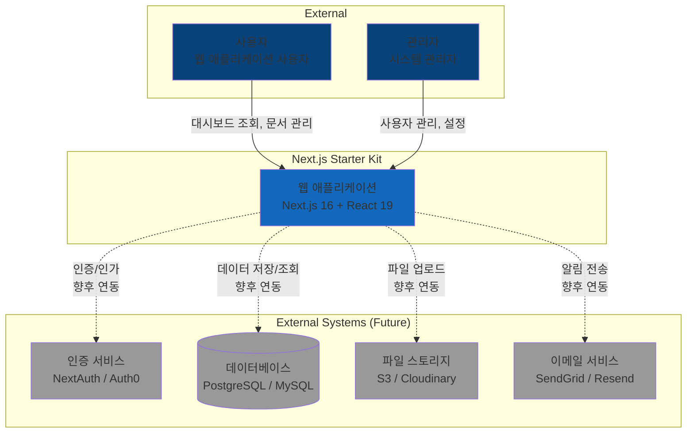

**주요 사용자**:
- **일반 사용자**: 대시보드 조회, 문서 관리, 분석 데이터 확인
- **관리자**: 사용자 관리, 역할/권한 설정, 시스템 설정

**외부 시스템** (향후 연동 예정):
- **인증 서비스**: NextAuth.js, Auth0, Clerk 등
- **데이터베이스**: PostgreSQL, MySQL, MongoDB 등
- **파일 스토리지**: AWS S3, Cloudinary, Vercel Blob 등
- **이메일 서비스**: SendGrid, Resend 등

---

## Level 2: Container Diagram (컨테이너 다이어그램)

시스템을 구성하는 주요 컨테이너(애플리케이션, 데이터베이스 등)를 보여줍니다.

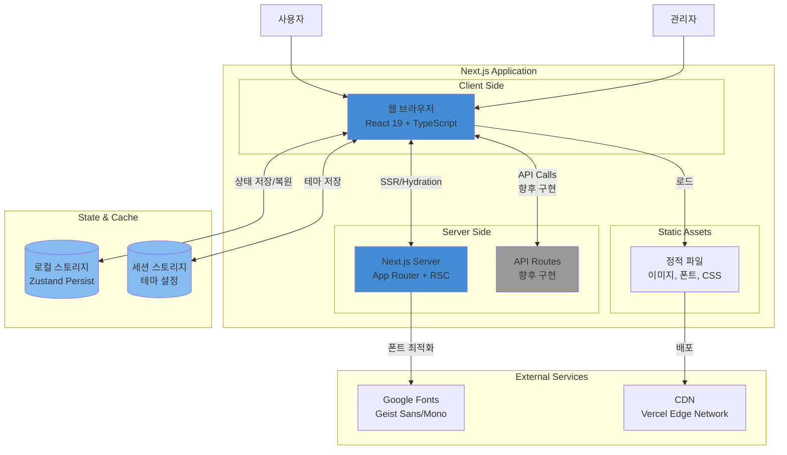

**컨테이너 설명**:

### 클라이언트 사이드
- **웹 브라우저**: React 19 기반 SPA, TypeScript로 작성
  - 라우팅: Next.js App Router
  - 스타일링: Tailwind CSS 4
  - 상태 관리: Zustand + React State
  - UI 컴포넌트: shadcn/ui (Radix UI)

### 서버 사이드
- **Next.js Server**: SSR, RSC 처리
  - App Router 기반 라우팅
  - React Server Components
  - 향후: Middleware 인증 처리

- **API Routes**: RESTful API 엔드포인트 (향후 구현)
  - `/api/v1/users`
  - `/api/v1/auth`
  - `/api/v1/documents`

### 상태 및 캐시
- **로컬 스토리지**: Zustand persist를 통한 상태 저장
  - 사이드바 상태
  - 사용자 설정
- **세션 스토리지**: 테마 설정 (next-themes)

### 외부 서비스
- **Google Fonts**: next/font를 통한 최적화된 폰트 로딩
- **CDN**: Vercel Edge Network (배포 시)

---

## Level 3: Component Diagram (컴포넌트 다이어그램)

애플리케이션 내부의 주요 컴포넌트와 그들 간의 관계를 보여줍니다.

### 3.1 전체 컴포넌트 구조

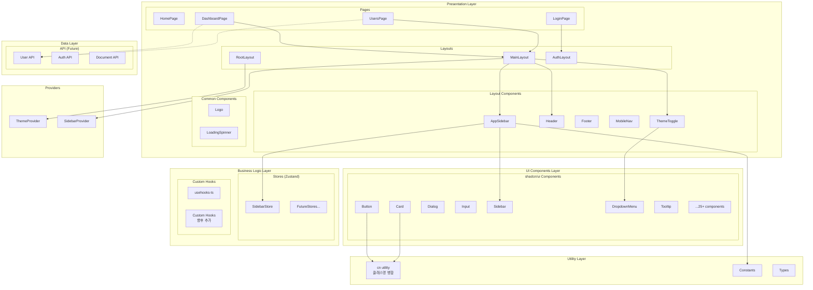

### 3.2 레이아웃 컴포넌트 상세

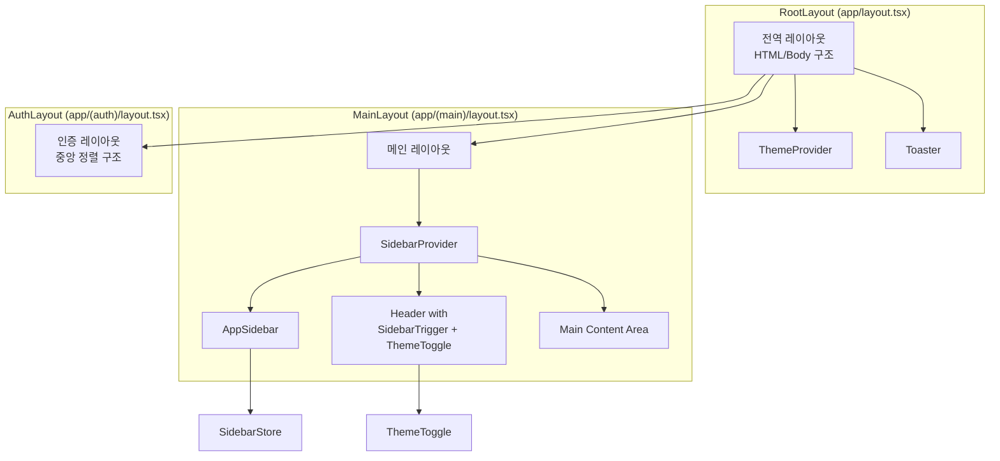

### 3.3 사이드바 컴포넌트 구조

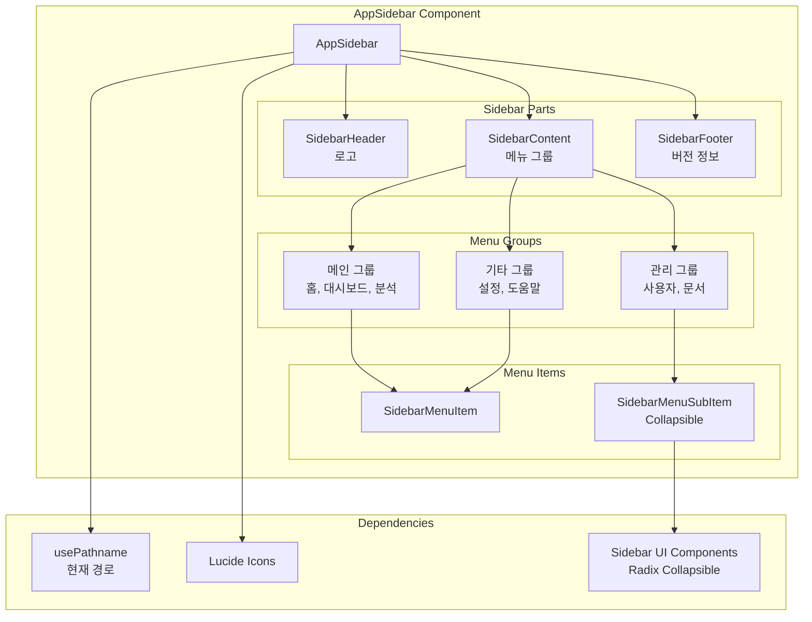

### 3.4 상태 관리 흐름

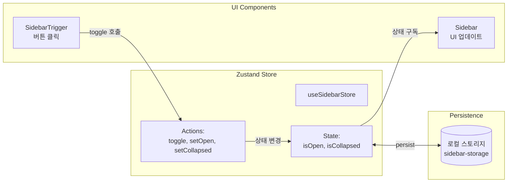

---

## Level 4: Code Diagram (코드 다이어그램)

주요 컴포넌트의 내부 구조를 보여줍니다.

### 4.1 useSidebarStore 구현 구조

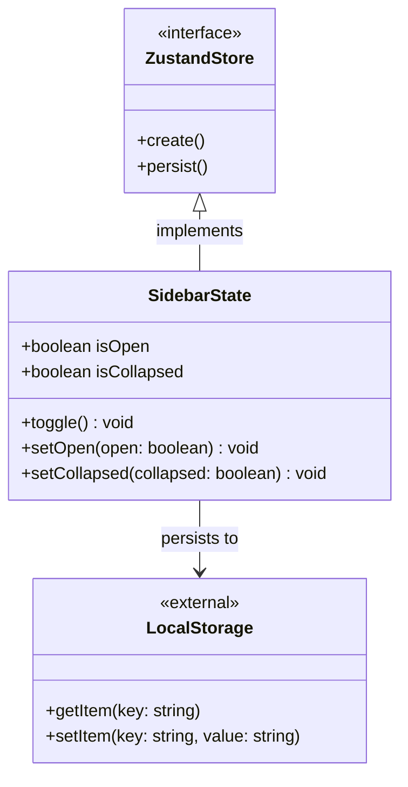

**코드 예시**:
```typescript
interface SidebarState {
  isOpen: boolean
  isCollapsed: boolean
  toggle: () => void
  setOpen: (open: boolean) => void
  setCollapsed: (collapsed: boolean) => void
}

export const useSidebarStore = create<SidebarState>()(
  persist(
    (set) => ({
      isOpen: true,
      isCollapsed: false,
      toggle: () => set((state) => ({ isOpen: !state.isOpen })),
      setOpen: (open) => set({ isOpen: open }),
      setCollapsed: (collapsed) => set({ isCollapsed: collapsed }),
    }),
    { name: 'sidebar-storage' }
  )
)
```

### 4.2 AppSidebar 컴포넌트 구조

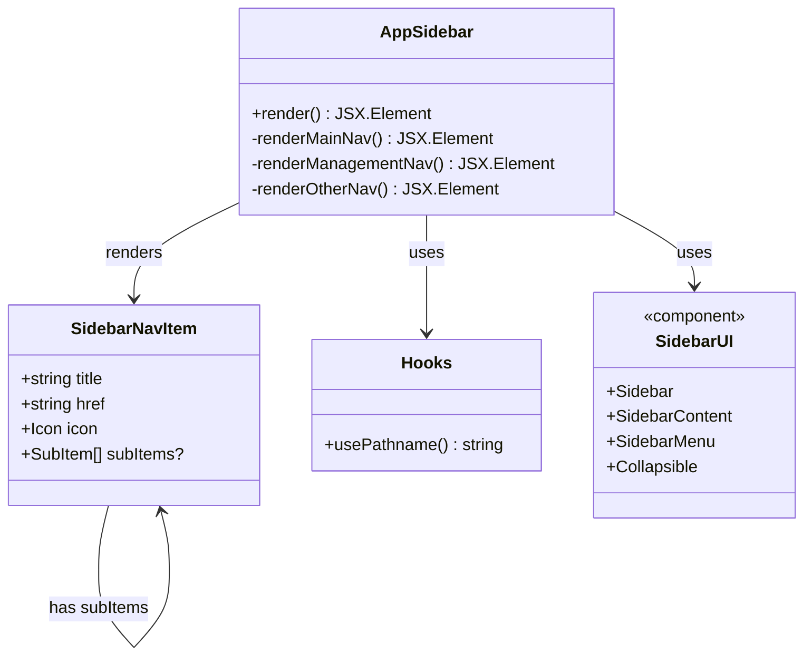

### 4.3 ThemeProvider 구조

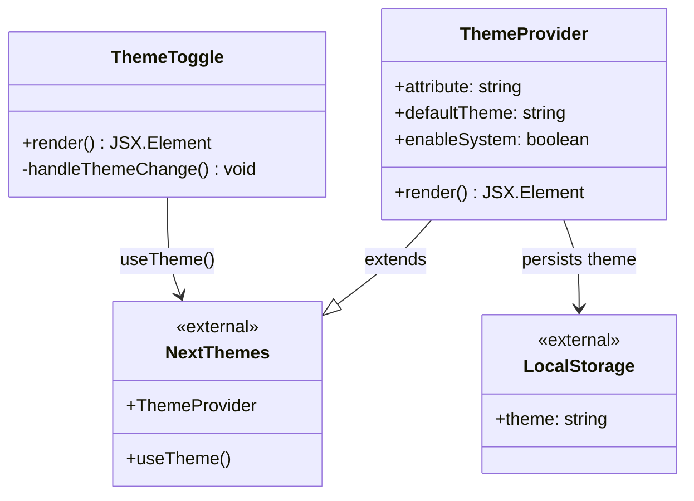

---

## 데이터 흐름 다이어그램

### 페이지 로딩 시퀀스

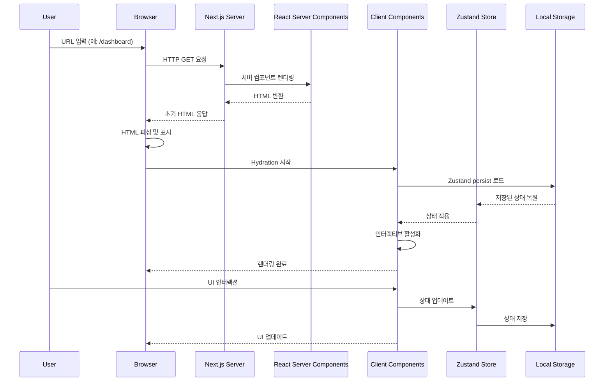

### 사이드바 토글 시퀀스

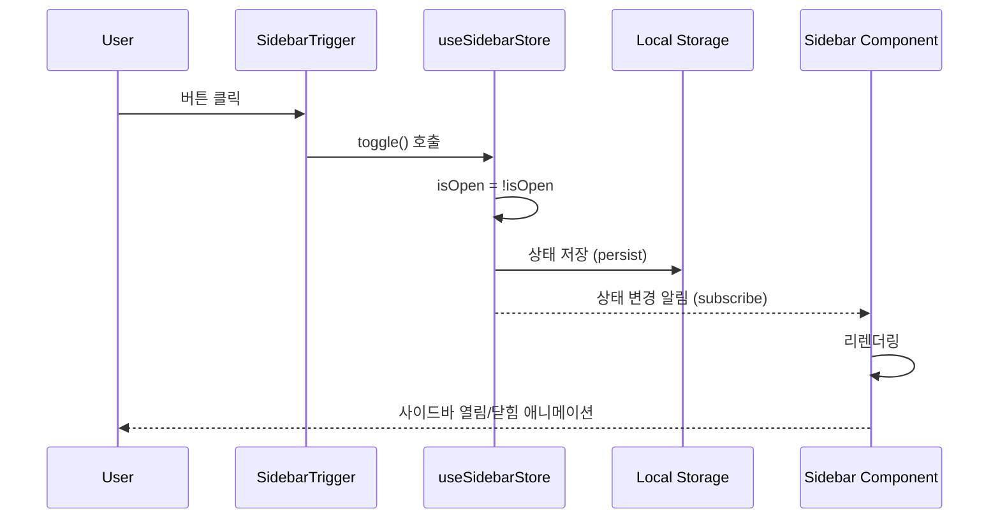

### 테마 전환 시퀀스

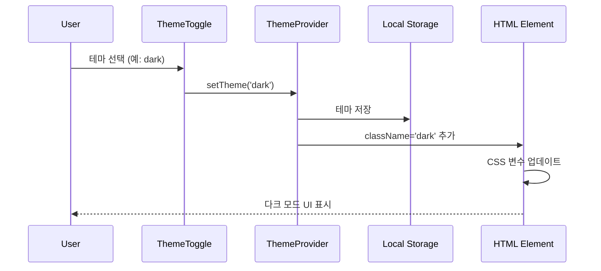

---

## 배포 아키텍처

### Vercel 배포 구조

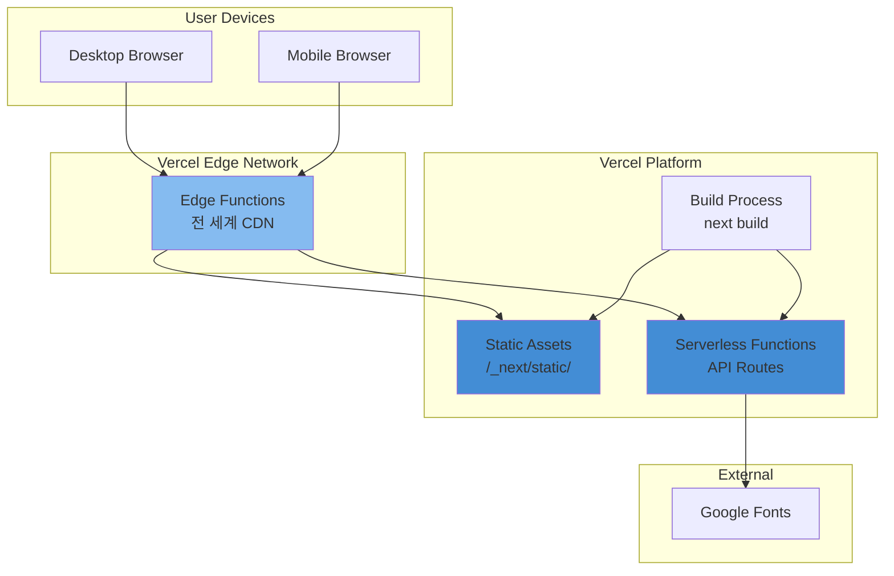

**배포 프로세스**:
1. **git push** → Vercel 자동 빌드 트리거
2. **빌드**: `next build` 실행
   - 정적 페이지 생성
   - 클라이언트 번들 최적화
   - 서버 컴포넌트 번들
3. **배포**: Edge Network에 분산
4. **캐싱**: CDN 캐싱 전략 적용

---

## 확장 시나리오

### 인증 시스템 추가 시

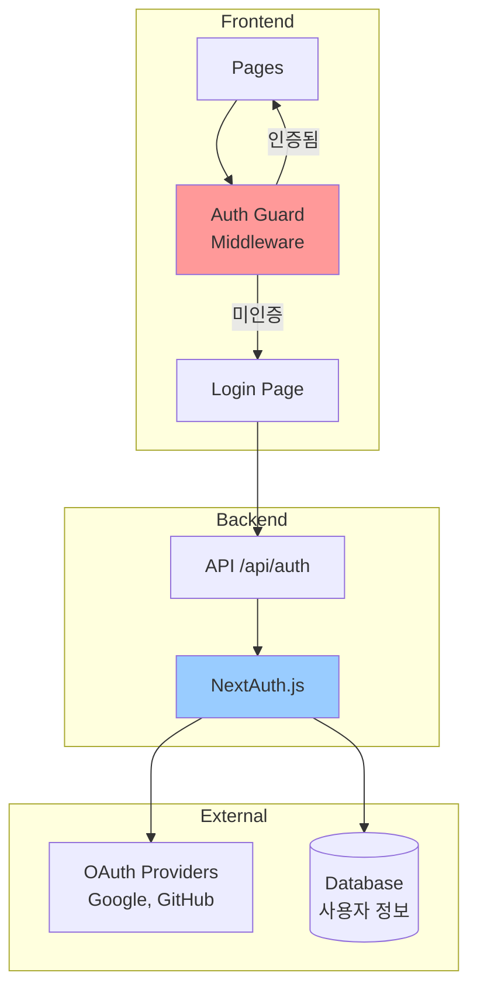

### 데이터베이스 연동 시

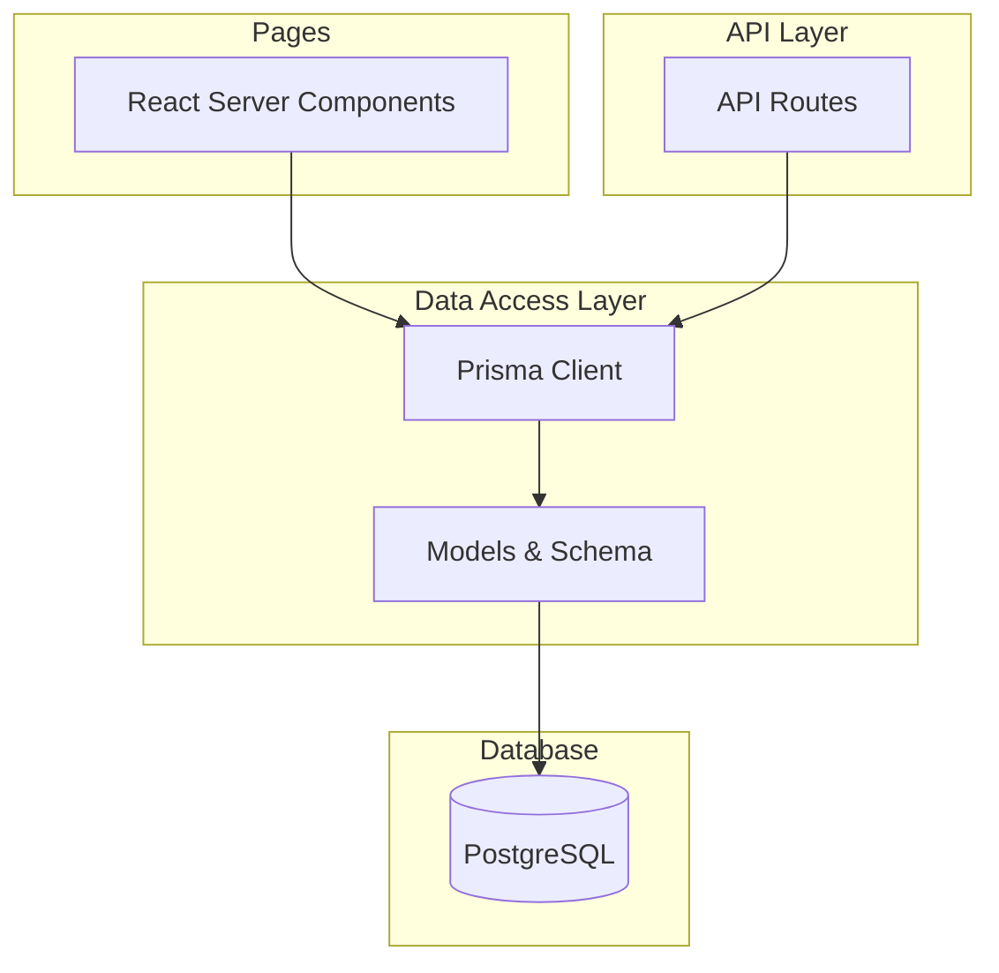

---

**문서 끝**

작성자: Claude Code Architecture Agent
최종 수정: 2026-01-27
